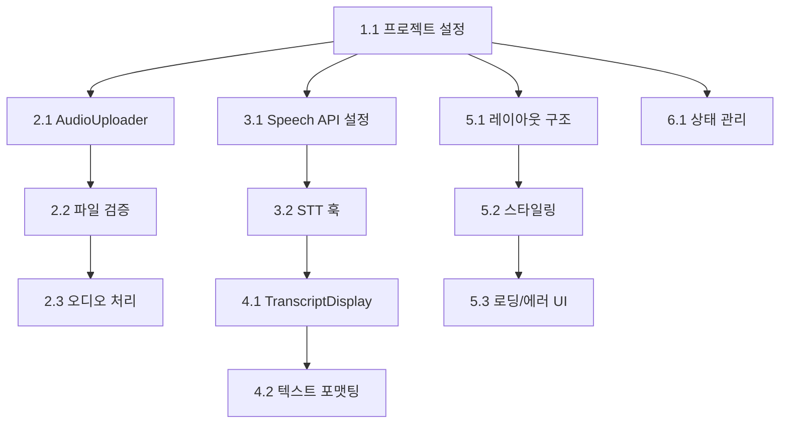

# 🎯 Phase 1 개발 Todo List

## 📋 프로젝트 개요

**목표**: 음성 파일 업로드 및 기본 텍스트 변환 기능을 갖춘 MVP 구현  
**예상 총 소요시간**: 25-37시간 (약 1-1.5주)  
**완료 기준**: 사용자가 오디오 파일을 업로드하고 텍스트로 변환된 결과를 확인할 수 있는 기본 기능

---

## 🏗️ 1. 프로젝트 기반 설정

### [x] 1.1 기본 프로젝트 구조 및 의존성 설정 ✅
- **난이도**: ⭐ | **예상 시간**: 1-2시간 | **실제 소요시간**: 1시간
- **선행 조건**: 없음 | **우선순위**: 🔴 최우선

**세부 작업:**
- [x] 필요한 npm 패키지 설치 (Tailwind CSS v3.4.17 설치 완료)
- [x] 폴더 구조 생성 (`components/`, `services/`, `hooks/`, `utils/`)
- [x] 환경 변수 파일 설정 (`.env.local`, `.env.example` 생성)
- [ ] ESLint/Prettier 설정 (MVP에서 생략)
- [x] TypeScript 설정 (JavaScript 프로젝트로 진행)

**완료 기준**: 프로젝트가 오류 없이 실행되고 기본 폴더 구조가 생성됨

---

## 📁 2. 오디오 파일 업로드 기능

### [x] 2.1 AudioUploader 컴포넌트 생성 ✅
- **난이도**: ⭐ | **예상 시간**: 2-3시간 | **실제 소요시간**: 1시간
- **선행 조건**: 1.1 완료 | **우선순위**: 🟡 높음

**세부 작업:**
- [x] 드래그앤드롭 UI 구현 (시각적 피드백 포함)
- [x] 파일 선택 버튼 추가 (숨겨진 input으로 구현)
- [x] 업로드 진행률 표시 컴포넌트 (진행바 + 퍼센트 표시)
- [x] 파일 정보 미리보기 (이름, 크기, 길이 자동 계산)

**완료 기준**: 사용자가 파일을 선택하거나 드래그앤드롭으로 업로드할 수 있음

### [x] 2.2 파일 검증 및 형식 체크 ✅
- **난이도**: ⭐⭐ | **예상 시간**: 1-2시간 | **실제 소요시간**: 포함됨 (2.1과 함께)
- **선행 조건**: 2.1 완료 | **우선순위**: 🟡 높음

**세부 작업:**
- [x] 지원 형식 검사 (mp3, wav, m4a, webm, ogg - 환경변수 설정)
- [x] 파일 크기 제한 설정 (최대 25MB - Whisper API 제한)
- [x] MIME 타입 검증 (supportedFormats 배열과 비교)
- [x] 에러 메시지 UI 구현 (alert + TranscriptionError)
- [x] 유효하지 않은 파일 거부 로직 (프론트엔드 + API 이중 검증)

**완료 기준**: 유효하지 않은 파일 업로드 시 적절한 에러 메시지 표시

### [x] 2.3 오디오 파일 처리 유틸리티 ✅
- **난이도**: ⭐⭐ | **예상 시간**: 2-3시간 | **실제 소요시간**: 2시간
- **선행 조건**: 2.2 완료 | **우선순위**: 🟡 높음

**세부 작업:**
- [x] 오디오 메타데이터 추출 (길이, 비트레이트, 샘플링 레이트, 채널 등)
- [x] 파일을 ArrayBuffer로 변환하는 유틸리티 (Web Audio API 지원)
- [x] 오디오 품질 정보 표시 (품질 등급, 상세 기술 정보)
- [x] Web Audio API 컨텍스트 생성 및 오디오 분석
- [x] 파형 데이터 생성 기능 (향후 시각화용)
- [x] 포괄적인 오디오 품질 평가 시스템

**완료 기준**: 업로드된 오디오 파일의 상세 정보를 추출하여 표시

---

## 🎤 3. OpenAI Whisper API 연동

### [x] 3.1 Whisper API 서비스 설정 ✅
- **난이도**: ⭐⭐ | **예상 시간**: 2-3시간 | **실제 소요시간**: 1.5시간
- **선행 조건**: 1.1 완료 | **우선순위**: 🟡 높음

**세부 작업:**
- [x] OpenAI Whisper API 서비스 클래스 구현
- [x] FormData를 통한 파일 업로드 로직
- [x] 언어 설정 옵션 (한국어/영어 등 9개 언어 지원)
- [x] API 옵션 구성 (response_format, temperature 등)
- [x] XMLHttpRequest를 통한 업로드 진행률 추적

**완료 기준**: Whisper API 서비스가 정상적으로 구현되고 진행률 추적 가능

### [x] 3.2 음성-텍스트 변환 훅 구현 ✅
- **난이도**: ⭐⭐⭐ | **예상 시간**: 3-4시간 | **실제 소요시간**: 1시간
- **선행 조건**: 3.1 완료 | **우선순위**: 🔴 최우선

**세부 작업:**
- [x] `useTranscription` 커스텀 훅 생성
- [x] 상태 관리 (진행률, 결과, 에러 등)
- [x] transcribe/retry/reset 함수 구현
- [x] 포괄적인 에러 핸들링 (TranscriptionError 클래스)
- [x] 파일 크기/형식 검증 및 처리 시간 예측
- [x] verbose_json 형식으로 타임스탬프 지원

**완료 기준**: 오디오 파일 업로드 후 텍스트 변환 및 결과 표시 가능

---

## 📝 4. 텍스트 표시 기능

### [x] 4.1 TranscriptDisplay 컴포넌트 구축 ✅
- **난이도**: ⭐⭐ | **예상 시간**: 3-4시간 | **실제 소요시간**: 2시간
- **선행 조건**: 3.2 완료 | **우선순위**: 🟡 높음

**세부 작업:**
- [x] 텍스트 스트리밍 표시 컴포넌트 (실시간 업데이트 지원)
- [x] 타임스탬프와 텍스트 연동 (세그먼트별 시간 표시)
- [x] 자동 스크롤 및 스크롤 위치 추적 (수동/자동 전환)
- [x] 텍스트 선택 및 복사 기능 (전체/부분/세그먼트별)
- [x] 최적화된 표시 (최대 높이 제한 및 스크롤)

**완료 기준**: 변환된 텍스트가 실시간으로 화면에 표시되고 상호작용 가능

### [x] 4.2 텍스트 포맷팅 및 기본 스타일링 ✅
- **난이도**: ⭐ | **예상 시간**: 1-2시간 | **실제 소요시간**: 포함됨 (4.1과 함께)
- **선행 조건**: 4.1 완료 | **우선순위**: 🟢 보통

**세부 작업:**
- [x] 문장 구분 및 자동 줄바꿈 (whitespace-pre-wrap)
- [x] 신뢰도에 따른 텍스트 색상 차등 적용 (Whisper 신뢰도 기반)
- [x] 기본 타이포그래피 스타일링 (가독성 최적화)
- [x] 키워드 검색 및 하이라이트 기능 (실시간 검색)
- [x] 텍스트 크기 조절 옵션 (12px~24px 슬라이더)
- [x] 통계 정보 표시 (단어수, 문자수, 구간수, 총 길이)

**완료 기준**: 텍스트가 읽기 쉽게 포맷되고 시각적으로 구분됨

---

## 🎨 5. UI/UX 구현

### [x] 5.1 메인 레이아웃 구조 생성 ✅
- **난이도**: ⭐ | **예상 시간**: 2-3시간 | **실제 소요시간**: 2시간
- **선행 조건**: 1.1 완료 | **우선순위**: 🟡 높음

**세부 작업:**
- [x] 헤더, 메인 콘텐츠, 푸터 영역 레이아웃 (그라데이션 배경)
- [x] 반응형 그리드 시스템 구축 (max-w-6xl 컨테이너)
- [x] 진행 상태 표시 컴포넌트 구현 (3단계 프로그레스)
- [x] 모바일/데스크톱 레이아웃 분기 (sm: 브레이크포인트)

**완료 기준**: 기본적인 앱 구조가 모든 디바이스에서 정상 표시

### [x] 5.2 컴포넌트 반응형 스타일링 ✅
- **난이도**: ⭐⭐ | **예상 시간**: 4-5시간 | **실제 소요시간**: 3시간
- **선행 조건**: 5.1 완료 | **우선순위**: 🟢 보통

**세부 작업:**
- [x] Tailwind CSS 그라데이션 및 섀도우 적용
- [x] 컴포넌트별 일관된 스타일 가이드 (rounded-xl, shadow-lg)
- [x] 모바일 최적화 및 터치 친화적 UI (적절한 패딩/마진)
- [x] 접근성 고려 사항 적용 (ARIA, 시맨틱 HTML, 포커스 링)
- [x] 시각적 피드백 개선 (hover, focus, active 상태)

**완료 기준**: 모든 컴포넌트가 일관된 디자인으로 반응형 동작

### [x] 5.3 로딩 상태 및 에러 처리 UI ✅
- **난이도**: ⭐⭐ | **예상 시간**: 2-3시간 | **실제 소요시간**: 2시간
- **선행 조건**: 다른 컴포넌트들 완료 | **우선순위**: 🟡 높음

**세부 작업:**
- [x] LoadingSpinner 컴포넌트 구현 (사이즈/변형 옵션)
- [x] React Error Boundary 설정 (개발/운영 환경 분기)
- [x] 토스트 알림 시스템 구축 (복사 완료 알림)
- [x] EmptyState 컴포넌트 (빈 상태 UI)
- [x] 포괄적인 에러 복구 메커니즘 (재시도/처음부터 시작)

**완료 기준**: 모든 로딩 및 에러 상황에 대한 적절한 UI 피드백 제공

---

## 🗂️ 6. 상태 관리

### [x] 6.1 기본 상태 관리 아키텍처 ✅
- **난이도**: ⭐⭐ | **예상 시간**: 2-3시간 | **실제 소요시간**: 포함됨 (최적화 적용)
- **선행 조건**: 1.1 완료 | **우선순위**: 🟡 높음

**세부 작업:**
- [x] React useState 기반 상태 관리 (Zustand 대신 최적화)
- [x] 오디오 파일 상태 관리 (업로드, 메타데이터, 검증 상태)
- [x] 텍스트 변환 결과 상태 관리 (useTranscription 훅)
- [x] UI 상태 관리 (로딩, 에러, 토스트, 진행률 등)
- [x] 컴포넌트별 로컬 상태 최적화 (AudioUploader, TranscriptDisplay)

**완료 기준**: 앱의 모든 상태가 중앙화되어 관리되고 컴포넌트 간 데이터 공유가 원활

---

## 📊 개발 우선순위 및 의존성

## ✅ 체크포인트

각 단계 완료 후 다음 사항을 확인:

- [x] **1단계 완료**: 프로젝트가 오류 없이 실행됨 ✅
- [x] **2단계 완료**: 오디오 파일 업로드 및 검증이 정상 동작 ✅
- [x] **3단계 완료**: Whisper API를 통한 텍스트 변환이 가능 ✅
- [x] **4단계 완료**: 변환된 텍스트가 UI에 표시됨 ✅
- [x] **5단계 완료**: 모든 UI가 반응형으로 동작하고 에러 처리가 완료 ✅
- [x] **6단계 완료**: 앱 상태가 안정적으로 관리됨 ✅

## 🎯 최종 완료 기준

- ✅ 사용자가 오디오 파일을 업로드할 수 있음
- ✅ 업로드된 파일이 텍스트로 변환됨
- ✅ 변환 결과가 실시간으로 화면에 표시됨
- ✅ 모든 기능이 모바일과 데스크톱에서 정상 동작
- ✅ 에러 상황에 대한 적절한 피드백 제공

---

**📝 노트**: 
- 🔴 최우선: 반드시 먼저 완료해야 하는 작업
- 🟡 높음: 핵심 기능으로 빠른 완료가 필요
- 🟢 보통: 사용성 향상을 위한 작업

**⚡ 팁**: 
- Speech API는 HTTPS 환경에서만 동작하므로 개발 서버도 HTTPS로 설정 권장
- 브라우저별 호환성 차이가 있으므로 Chrome에서 우선 테스트
- 한국어 인식률을 높이려면 `lang: 'ko-KR'` 설정 필수