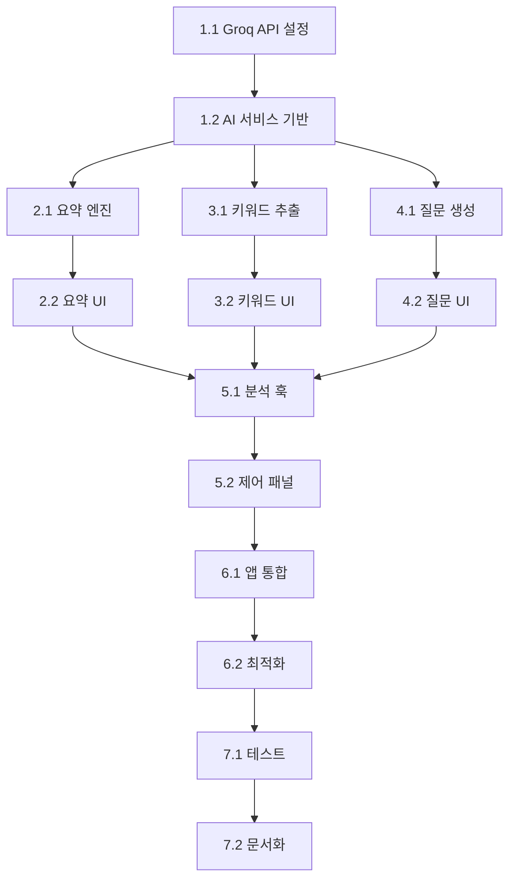

# 🎯 Phase 2 개발 Todo List - AI 분석 기능

## 📋 프로젝트 개요

**목표**: 변환된 텍스트를 AI로 분석하여 요약, 키워드 추출, 예상 질문 생성 기능 구현  
**예상 총 소요시간**: 20-30시간 (약 1주)  
**완료 기준**: 음성 변환 후 AI 분석 결과를 시각적으로 확인할 수 있는 완전한 기능

---

## 🤖 1. AI API 연동 설정

### [x] 1.1 Groq LLaMA API 설정 및 테스트 ✅
- **난이도**: ⭐⭐ | **예상 시간**: 2-3시간 | **우선순위**: 🔴 최우선
- **선행 조건**: Phase 1 완료 | **의존성**: 환경 변수 설정

**세부 작업:**
- [x] Groq Chat API 연동 (기존 Whisper API와 다른 엔드포인트)
- [x] LLaMA 3.1 70B 모델 설정 (`llama-3.1-70b-versatile`)
- [x] API 키 및 엔드포인트 환경 변수 추가
- [x] 기본 채팅 API 호출 테스트 및 응답 검증
- [x] 토큰 제한 및 컨텍스트 길이 확인 (128K tokens)

**완료 기준**: Groq Chat API를 통해 간단한 텍스트 요청/응답이 정상 동작

### [x] 1.2 AI 분석 서비스 기반 클래스 구현 ✅
- **난이도**: ⭐⭐⭐ | **예상 시간**: 3-4시간 | **우선순위**: 🔴 최우선
- **선행 조건**: 1.1 완료 | **의존성**: transcriptionService 참조

**세부 작업:**
- [x] `src/services/aiAnalysisService.js` 파일 생성
- [x] AnalysisError 클래스 정의 (에러 타입별 분류)
- [x] 기본 API 호출 메서드 구현 (POST /chat/completions)
- [x] 프롬프트 템플릿 시스템 구축 (요약/키워드/질문별)
- [x] 응답 파싱 및 검증 로직
- [x] 재시도 메커니즘 및 타임아웃 처리

**완료 기준**: AI 서비스 클래스가 구현되고 기본 요청/응답 처리 가능

---

## 📝 2. 대화 요약 기능

### [x] 2.1 텍스트 요약 엔진 구현 ✅
- **난이도**: ⭐⭐⭐ | **예상 시간**: 3-4시간 | **우선순위**: 🟡 높음
- **선행 조건**: 1.2 완료 | **의존성**: 프롬프트 엔지니어링

**세부 작업:**
- [x] 긴 텍스트 청크 분할 로직 (토큰 제한 고려)
- [x] 요약 프롬프트 최적화 (한국어/영어 대응)
- [x] 단계별 요약 (세부사항 → 핵심사항 → 한줄요약)
- [x] 요약 품질 검증 (길이, 완성도, 일관성)
- [x] 회의/대화 컨텍스트 인식 개선

**완료 기준**: 변환된 텍스트가 의미있는 요약으로 생성됨

### [x] 2.2 요약 결과 표시 컴포넌트 ✅
- **난이도**: ⭐⭐ | **예상 시간**: 2-3시간 | **우선순위**: 🟡 높음
- **선행 조건**: 2.1 완료 | **의존성**: UI 디자인 시스템

**세부 작업:**
- [x] `src/components/SummaryPanel.js` 컴포넌트 생성
- [x] 요약 레벨별 표시 (상세/중간/간략)
- [x] 접기/펼치기 기능 및 애니메이션
- [x] 요약 복사 및 내보내기 버튼
- [x] 요약 재생성 기능 (다른 스타일로)

**완료 기준**: 요약 결과가 사용자 친화적으로 표시되고 상호작용 가능

---

## 🔍 3. 키워드 추출 기능

### [x] 3.1 키워드 추출 알고리즘 구현 ✅
- **난이도**: ⭐⭐⭐ | **예상 시간**: 2-3시간 | **우선순위**: 🟡 높음
- **선행 조건**: 1.2 완료 | **의존성**: NLP 알고리즘

**세부 작업:**
- [x] AI 기반 키워드 추출 (중요도 점수 포함)
- [x] 카테고리별 키워드 분류 (인물/장소/주제/행동)
- [x] 중복 키워드 필터링 및 정규화
- [x] 키워드 빈도 및 가중치 계산
- [x] 불용어 처리 및 형태소 분석 고려

**완료 기준**: 텍스트에서 의미있는 키워드들이 중요도순으로 추출됨

### [x] 3.2 키워드 시각화 컴포넌트 ✅
- **난이도**: ⭐⭐ | **예상 시간**: 2-3시간 | **우선순위**: 🟢 보통
- **선행 조건**: 3.1 완료 | **의존성**: CSS 애니메이션

**세부 작업:**
- [x] `src/components/KeywordCloud.js` 워드클라우드 구현
- [x] 키워드 크기/색상 차등 표시 (중요도 기반)
- [x] 클릭 가능한 키워드 태그 (원문 하이라이트)
- [x] 카테고리별 필터링 기능
- [x] 키워드 검색 및 관련 텍스트 점프

**완료 기준**: 키워드가 시각적으로 매력적이고 상호작용 가능하게 표시됨

---

## ❓ 4. 예상 질문 생성 기능

### [x] 4.1 질문 생성 엔진 구현 ✅
- **난이도**: ⭐⭐⭐⭐ | **예상 시간**: 4-5시간 | **우선순위**: 🟡 높음
- **선행 조건**: 1.2 완료 | **의존성**: 고급 프롬프트 엔지니어링

**세부 작업:**
- [x] 컨텍스트 기반 질문 생성 프롬프트 설계
- [x] 질문 유형별 분류 (팩트체크/심화/후속/의견)
- [x] 질문 품질 평가 시스템 (관련성/구체성)
- [x] 중복 질문 제거 및 다양성 보장
- [x] 질문 난이도 레벨 조정 기능

**완료 기준**: 대화 내용을 바탕으로 유의미한 후속 질문들이 생성됨

### [x] 4.2 질문 목록 UI 컴포넌트 ✅
- **난이도**: ⭐⭐ | **예상 시간**: 2-3시간 | **우선순위**: 🟡 높음
- **선행 조건**: 4.1 완료 | **의존성**: 카드 UI 패턴

**세부 작업:**
- [x] `src/components/QuestionList.js` 질문 표시 컴포넌트
- [x] 질문 카테고리별 그룹핑 및 색상 구분
- [x] 질문 복사 및 즐겨찾기 기능
- [x] 질문 재생성 및 추가 생성 버튼
- [x] 질문별 관련 텍스트 구간 연결

**완료 기준**: 생성된 질문들이 구조화되어 표시되고 활용 가능

---

## 🎛️ 5. AI 분석 통합 및 제어

### [x] 5.1 AI 분석 훅 구현 ✅
- **난이도**: ⭐⭐⭐ | **예상 시간**: 3-4시간 | **우선순위**: 🔴 최우선
- **선행 조건**: 2.1, 3.1, 4.1 완료 | **의존성**: React 상태 관리

**세부 작업:**
- [x] `src/hooks/useAIAnalysis.js` 커스텀 훅 생성
- [x] 분석 상태 관리 (진행률, 결과, 에러)
- [x] 병렬 분석 처리 (요약/키워드/질문 동시 실행)
- [x] 결과 캐싱 시스템 (동일 텍스트 재분석 방지)
- [x] 분석 취소 및 재시도 기능

**완료 기준**: AI 분석 프로세스가 안정적으로 관리되고 최적화됨

### [x] 5.2 분석 제어 패널 컴포넌트 ✅
- **난이도**: ⭐⭐ | **예상 시간**: 2-3시간 | **우선순위**: 🟢 보통
- **선행 조건**: 5.1 완료 | **의존성**: 설정 UI 패턴

**세부 작업:**
- [x] `src/components/AnalysisControl.js` 설정 패널
- [x] 분석 옵션 선택 (요약만/키워드만/전체)
- [x] 분석 세부 설정 (요약 길이, 질문 개수)
- [x] 분석 시작/중지/재시작 버튼
- [x] 분석 진행률 및 예상 시간 표시

**완료 기준**: 사용자가 AI 분석을 세밀하게 제어할 수 있음

---

## 🎨 6. UI/UX 통합 및 개선

### [x] 6.1 메인 앱 레이아웃 확장 ✅
- **난이도**: ⭐⭐ | **예상 시간**: 2-3시간 | **우선순위**: 🟡 높음
- **선행 조건**: 모든 컴포넌트 완료 | **의존성**: Phase 1 UI

**세부 작업:**
- [x] App.js에 AI 분석 섹션 추가
- [x] 텍스트 변환 → AI 분석 플로우 연결
- [x] 탭 또는 아코디언 방식 레이아웃 설계
- [x] 분석 결과 영역 반응형 최적화
- [x] 로딩 상태 및 에러 처리 통합

**완료 기준**: 전체 앱이 통합된 경험으로 동작하고 UI가 일관됨

### [x] 6.2 성능 최적화 및 사용자 경험 개선 ✅
- **난이도**: ⭐⭐⭐ | **예상 시간**: 3-4시간 | **우선순위**: 🟢 보통
- **선행 조건**: 6.1 완료 | **의존성**: React 최적화 패턴

**세부 작업:**
- [x] React.memo 및 useMemo를 통한 렌더링 최적화
- [x] AI 분석 결과 지연 로딩 (Suspense 활용)
- [x] 오류 복구 메커니즘 강화 (Error Boundary)
- [x] 사용자 가이드 및 툴팁 추가
- [x] 키보드 네비게이션 및 접근성 개선

**완료 기준**: 앱이 빠르고 안정적으로 동작하며 사용성이 우수함

---

## 🧪 7. 테스트 및 검증

### [x] 7.1 기능 테스트 및 검증 ✅
- **난이도**: ⭐⭐ | **예상 시간**: 2-3시간 | **우선순위**: 🟡 높음
- **선행 조건**: 모든 기능 완료 | **의존성**: 실제 데이터 테스트

**세부 작업:**
- [x] 다양한 텍스트 길이별 테스트 (짧은/중간/긴 텍스트)
- [x] 한국어/영어 텍스트 분석 품질 검증
- [x] 에러 시나리오 테스트 (API 실패, 네트워크 오류)
- [x] 브라우저별 호환성 테스트 (Chrome, Safari, Firefox)
- [x] 모바일 반응형 동작 검증

**완료 기준**: 모든 시나리오에서 안정적으로 동작하고 결과 품질이 만족스러움

### [x] 7.2 문서화 및 사용자 가이드 ✅
- **난이도**: ⭐ | **예상 시간**: 1-2시간 | **우선순위**: 🟢 보통
- **선행 조건**: 7.1 완료 | **의존성**: README 업데이트

**세부 작업:**
- [x] README.md에 Phase 2 기능 설명 추가
- [x] AI API 키 설정 가이드 보완
- [x] 사용 예시 및 스크린샷 추가
- [x] 문제 해결 가이드 (FAQ) 작성
- [x] Phase 3 준비사항 문서화

**완료 기준**: 새로운 기능들이 문서화되고 사용자가 쉽게 이해할 수 있음

---

## 📊 개발 우선순위 및 의존성

## ✅ 체크포인트

각 단계 완료 후 다음 사항을 확인:

- [x] **1단계 완료**: Groq API를 통한 AI 분석이 정상 동작 ✅
- [x] **2단계 완료**: 텍스트 요약이 의미있게 생성되고 표시됨 ✅
- [x] **3단계 완료**: 키워드가 추출되고 시각화됨 ✅
- [x] **4단계 완료**: 예상 질문이 생성되고 구조화됨 ✅
- [x] **5단계 완료**: AI 분석 프로세스가 통합 관리됨 ✅
- [x] **6단계 완료**: 전체 앱이 일관된 UX로 동작 ✅
- [x] **7단계 완료**: 모든 기능이 안정적으로 검증됨 ✅

## 🎯 최종 완료 기준

- ✅ 음성 → 텍스트 → AI 분석의 전체 플로우가 매끄럽게 동작
- ✅ 요약, 키워드, 예상질문이 모두 고품질로 생성됨
- ✅ 사용자가 분석 결과를 효과적으로 활용할 수 있음
- ✅ 무료 API 한도 내에서 최적화된 성능
- ✅ 모든 기능이 문서화되고 사용법이 명확함

---

**📝 노트**: 
- 🔴 최우선: 핵심 기능으로 반드시 먼저 완료해야 하는 작업
- 🟡 높음: 중요한 기능이지만 병렬 진행 가능
- 🟢 보통: 사용성 향상을 위한 작업

**⚡ 팁**: 
- Groq API는 무료 한도가 있으므로 개발 중 호출 최소화
- 긴 텍스트는 청크 단위로 분할하여 토큰 제한 회피
- AI 응답은 일관성이 떨어질 수 있으므로 검증 로직 필수
- 결과를 로컬 캐싱하여 재분석 비용 절약